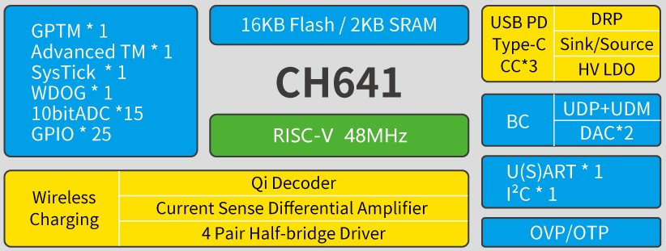

# [CH641](https://github.com/SoCXin/CH641)

* [WCH](http://www.wch.cn/)：[RISC-V](https://github.com/SoCXin/RISC-V)
* [L1R1](https://github.com/SoCXin/Level): 48 MHz

## [简介](https://github.com/SoCXin/CH641/wiki)

[CH641](https://www.wch.cn/products/CH641.html)系列是基于[QingKe-青稞RISC-V2A](https://www.wch.cn/products/QingKe.html)内核设计的PD无线充电专用微控制器。该系列具有宽压、单线调试、低功耗、外围精简等特点。CH641内置PD PHY、BC接口、差分输入电流采样和交流小信号放大解码器，支持USB PD及Type-C快充功能、BC1.2及DCP等多种高压充电协议，提供了DMA控制器、10位模数转换ADC、多组定时器、USART串口、I2C等丰富的外设资源，提供过压保护和过温保护。

### 关键特性

* 48MHz RISC-V2A
* 2KB SRAM + 16KB Flash
* 7路通用DMA控制器
* 多路外部10位ADC转换通道
* 多组定时器，包括高级定时器、通用定时器、看门狗定时器以及系统时基定时器
* 1组多引脚映射的USART串口
* 1个I2C从机接口
* USB PD和Type-C控制器及PHY
* 1组BC接口
* 差分输入电流采样ISP/ISN
* 交流小信号放大解码器QII
* GPIO端口，4个高压驱动引脚，5个低压强驱动引脚
* OVP过压保护和OTP过温保护 
* 封装：QFN16、QFN20、QFN28

## [资源收录](https://github.com/SoCXin)

* [参考资源](src/)
* [参考文档](docs/)
* [参考工程](project/)
* [mounriver](http://www.mounriver.com/download)

## [选型建议](https://github.com/SoCXin)

[CH641](https://github.com/SoCXin/CH641)

